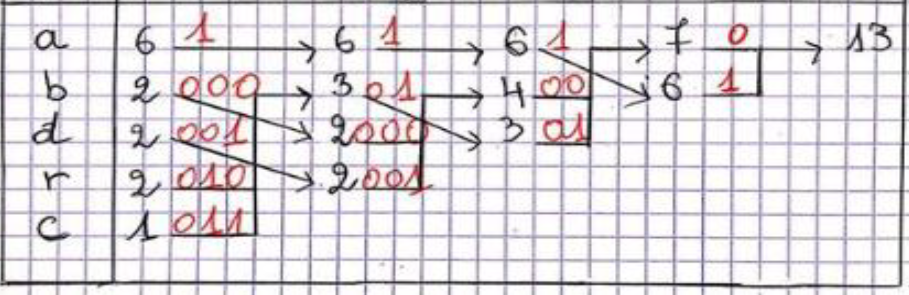

# Codage-Huffman
Projet académique

Le codage entropique de Huffman est une transformation d'une représentation de données en une autre, réduite et sans perte.

Les étapes du codage par exemple pour une chaine de caractères :

1. Lister les caractères sans répétition;
2. Trouver le nombre d'occurrence pour chaque caractères;
3. Trier les nombres d'occurrence du plus grand au plus petit, changer également la positions des caractères ;
4. Additionner les deux derniers nombres, puis faire le classement ; 
5. Refaire l'étape 4 jusqu'à ce qui reste deux nombres;
6. Affecter le digite 0 au premier nombre et 1 au deuxième;
7. recopier ces digites sur les deux nombres sommés puis ajouter le digité 0 au plus grand nombre et 1 au plus petit;
8. Refaire l'étape 6 jusqu'à la fin; (voir l'exemple)

### Exemple :
Soit une chaine de caractères << chaine = "abracadabrada"

